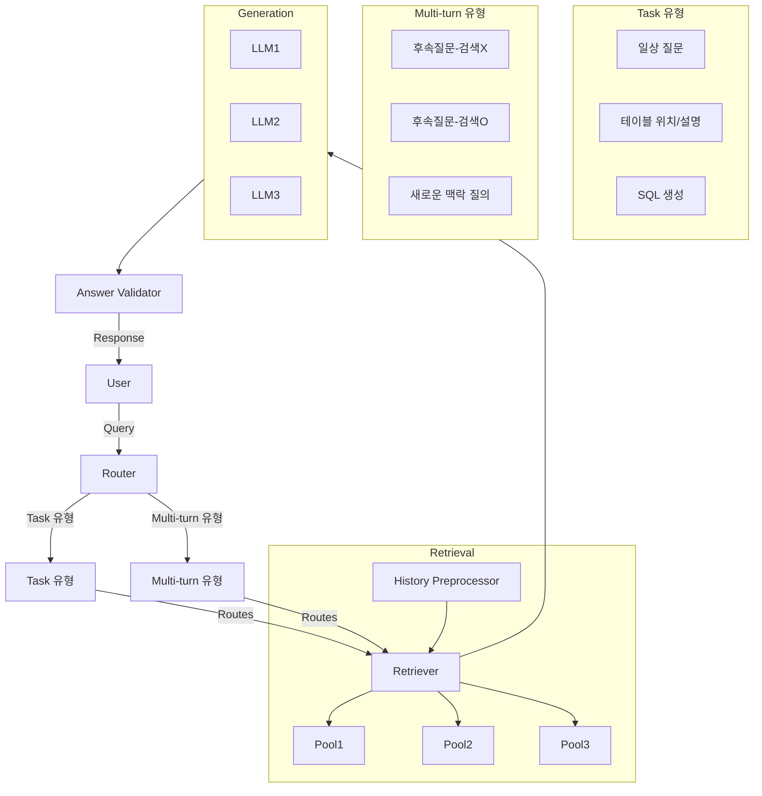

- 정보 수집 > 정보 가공 > 정보 생성 > 정보 검토 
  - 정보 생성 단계에서 LLM을 활용하였음 

- Lexical Search 
  - 사용자가 입력한 키워드를 포함한 문서를 찾아내는 검색 방식 
    - 간단하고 직관적 
    - 빠른 처리 속도 
    - 문맥 무시 
    - 오타에 민감 
- Semantic Search 
  - NLP 모델을 이용하여 의미/문맥을 고려하는 검색 방식 
    - 의미/문맥 이해 
    - 오타에 덜 민감 
    - 비교적 느린 처리 속도 
    - 정확도 문제 

- 문제 
  - 특정 질의에 대해서 검색을 잘 못함 
  - Document에 담겨있는 정보가 많아서 유사도가 희석됨
- 해결 
  - 데이터 특징에 따라 분리해서 Pool을 생성 
    - 데이터 특징에 따라서 
      - 풀을 구분한다. 
        - 테이블 풀, 설명 풀, 칼럼 풀을 구성한다. 
    - Hybrid Search를 Lexical / Semantic을 모두 Pool에서 접근하여 처리하였음 

- 7B 모델을 이용한 FineTuning 하였음 
  - 학슴 데이터셋을 직접 구축하였음 
  - 검색 결과 Rank에 강건하도록 훈련 
  - 훈련 데이터 셋의 증강 자체가 이점이 있지 않음  
  - Prompting 고도화 
  - LoRa를 이용해서 데이터의 전체적인 사이즈는 최소화하였음 
    - Multiple LoRA Adaters 구조로 비용 효율화 

> RAFT : Adapting Language Modtel to Domain Specific RAG   
> Chain of Thought Prompting Elicits Reasoning in Large Language Models 

- Multi-Turn 
  - 히스토리 관리에 대한 고민 
  - 과도한 정보로 인한 품질 저하  
  - 히스토리를 최대한 짧게 유지 
  - 질문의 분류를 새로운 맥락과 신규 질문의 맥락을 분리함 
  - 기존 맥락 기반으로 검색  

대화의 흐름에 맞게 적절한 정보를 참조 하는 방식  

- 요약 
  - 데이터의 질이 모델 성능의 핵심이다. 
  - 검색 정확도를 올리는 것  
  - LLM은 비용과의 싸움이다. 비용 절감을 위해 소형 모델을 사용할 땐 LoRA를 활용하여 도메인별 전문 모델 구축 
  - Multi-Turn. 속도와 정확도를 위해서 히스토리 관리가 필수적