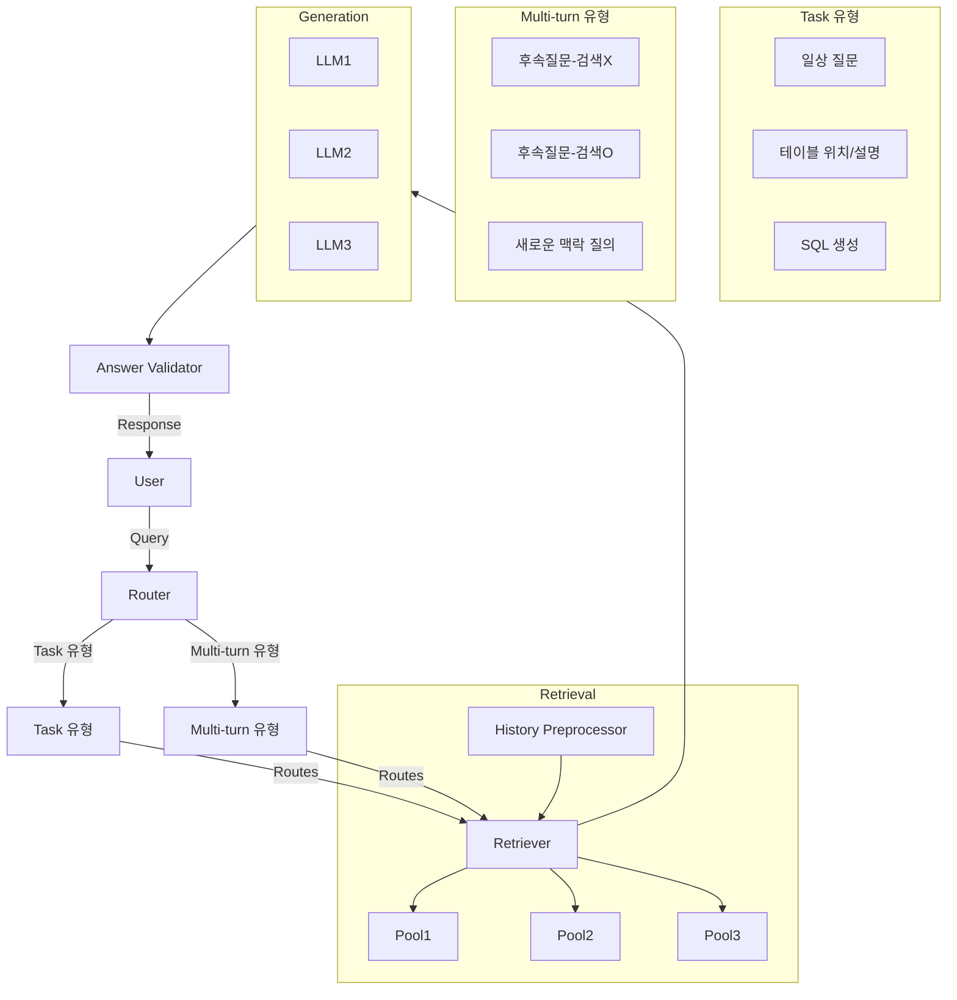

## Process Workflow

- **Information Gathering > Information Processing > Information Generation > Information Review**
  - Utilized LLM in the information generation phase.

## Search Methods

- **Lexical Search**
  - A search method that finds documents containing keywords entered by the user.
    - Simple and intuitive
    - Fast processing speed
    - Ignores context
    - Sensitive to typos

- **Semantic Search**
  - A search method that considers meaning and context using NLP models.
    - Understands meaning/context
    - Less sensitive to typos
    - Comparatively slower processing speed
    - Accuracy issues

## Challenges

- Struggles with certain specific queries.
- High information density in documents dilutes similarity.

## Solution

- Segregate data to create pools based on data characteristics.
  - Separate pools according to data features:
    - Set up table pools, description pools, and column pools.
  - Processed Hybrid Search across both lexical and semantic pools.

## Model Fine-Tuning

- Fine-Tuned with a 7B Model
  - Built a custom training dataset.
  - Trained for robustness in search result ranking.
  - Data augmentation of training datasets offers minimal benefits.
  - Advanced prompting techniques.
  - Minimized overall data size using LoRa.
    - Optimized cost efficiency with multiple LoRa adapters.

## References

> RAFT: Adapting Language Models to Domain-Specific RAG  
> Chain of Thought Prompting Elicits Reasoning in Large Language Models

## Multi-Turn Interaction

- Consideration of history management.
- Quality degradation due to excessive information.
- Maintains history as briefly as possible.
- Separates context for new questions from ongoing contexts.
- Searches based on existing context.

## Summary

- The quality of data is key to model performance.
- Improving search accuracy.
- LLM usage is a battle with cost; to reduce costs, use LoRA with smaller models to build specialized domain models.
- Multi-Turn: History management is essential for speed and accuracy.